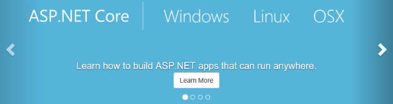

## ASP.NET X Angular2

### Writer: JB

This ebook includes building basic **ASP.NET Core** application and how to integrate with **Angular**.

此系列的文章我原始刊載於**2017 iT邦幫忙鐵人賽**系列文章 ： [Learning ASP.NET core + Angular2](http://ithelp.ithome.com.tw/users/20103220/ironman/1001)

---

> Angular is a development platform for building mobile and desktop web applications.

> ASP.NET Core is a new open-source and cross-platform framework for building modern cloud based internet connected applications, such as web apps, IoT apps and mobile backends.

## Who am I

I am a [Star Wars](http://www.starwars.com/) biggest fan, a blogger and a father :)

At work, I am a technical project manager and focus on Project/Product management, Scrum and full-stack development. 
You can find me on my [Blog](http://karatejb.blogspot.tw/).
