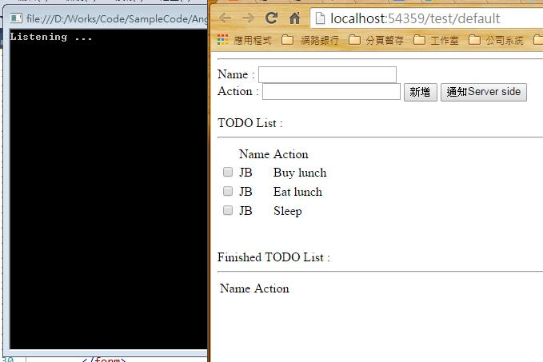
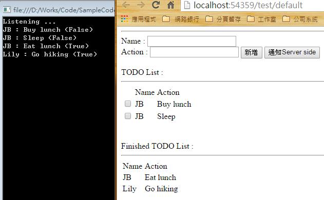

## Introduction
---

在上一篇文章中，已建立一可在前端做新增/查詢的頁面； 此文章會利用原本的程式，實作從Server Side後端取得資料及送回資料的部分。


## Implement
---

#### 後端Entry point

後端以Web Api做開發，可參考此篇文章建立：OWIN - WebApi Self-host

#### 預期結果

預設開啟畫面，左為Self-host的Web api。  右邊頁面上的三個待做事項，則改從後端抓回來。




按下【通知Server Side】後，後端的Console會即時呈現從前端傳回的四筆資料。




* HTML

頁面上只有新增一個按鈕。

```
<input type="button" id="sendToServer" value="通知Server side" ng-click="sendToServer()" />
```


* JS

```
var app = angular.module('app', [])
.controller('TodoCtrl', function ($scope,$http) {
    $scope.newName = "";
    $scope.newAction = "";
    $scope.newIsFinish = false;

    var getUrl = "http://localhost:7531/api/todo/Get";
    $http.get(getUrl).success(function (data) {
        $scope.todoList = data;
    }).error(function (data, status, headers, config) {
        console.log(data, status, headers, config);
    });

    //$scope.todoList = [{ MyName: "JB", MyAction: "Buy Milk", IsFinish: false }, { MyName: "JB", MyAction: "See Movie", IsFinish: false }];

    $scope.addItem = function () {
        if (this.newName && this.newAction)
        {
            this.todoList.push({ MyName: this.newName, MyAction: this.newAction, IsFinish: this.newIsFinish });
            this.newName = "";
            this.newAction = "";
        }
    }
   
    $scope.removeItem = function (item) {
        item.IsFinish = true;
    }

    $scope.sendToServer = function () {
        var postUrl = "http://localhost:7531/api/todo/Print";
        $http.post(postUrl, $scope.todoList).success(function (data) {
        }).error(function (data, status, headers, config) {
            console.log(data, status, headers, config);
        });
    }

});
```


主要修改兩個地方：
1. 將原本寫死的資料物件集合，以Ajax方式從Server side帶回來給 $scope.todoList。
2. 按下按鈕後，將$scope.todoList POST到後端。


## Reference
---

[$http (AngularJS Official Document)](https://docs.angularjs.org/api/ng/service/$http)