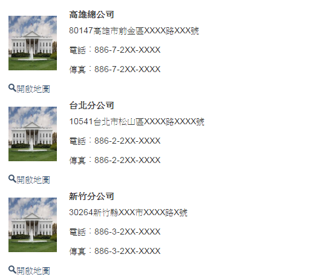
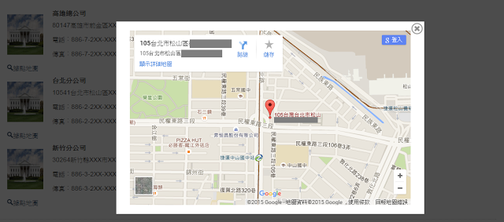

## Introduction
使用AngularJS練習如何在網站上內嵌Google map。


## Implement

### 預期結果

進入頁面後，將資料庫的資料逐筆列出。



使用者點選 ”開啟地圖” 後， 產生背景遮罩，並顯示Google Map。
如果按下右上方的關閉按鈕，則將遮罩及Google Map關閉。




#### Backend (ASP.NET MVC)

以Entity Framework Code first實作以下地點資訊：

```
public class MapReference
{
        [Key]
        [DatabaseGenerated(DatabaseGeneratedOption.Identity)]
        public int Id { get; set; }
        [StringLength(100)]
        public String Title { get; set; }
        [StringLength(200)]
        public String Description { get; set; }
        [StringLength(50)]
        public String PhoneNumber { get; set; }
        [StringLength(50)]
        public String FaxNumber { get; set; }

        public String GoogleMapUri { get; set; }

}
```

Initial 資料：


PS. 內嵌Google Map的Url可如下圖取得；


 


新增一個Http Get method以取得後端資料。

```
[HttpGet]
public ActionResult GetMapReferences()
{
     using (var mrService = new MapReferenceService())
     {
         return Json(mrService.Query(x=>true), JsonRequestBehavior.AllowGet);
     }
}
```


* HTML

畫面設計上分成兩塊Div，一個是主要顯示列表的資訊，另一個是包含遮罩及顯示Google Map的iframe。

```
<div id="mapDiv" ng-controller="DataCtrl">
        <ul class="list-photo">
            <li>
                <table  ng-repeat="item in mapReferenceList" >
                    <tr>
                        <td rowspan="4"></td>
                        <td>
                        <th colspan="2">{{item.Title}}</th>
                        </td>
                    </tr>
                    <tr>
                        <td></td>
                        <td>{{item.Description}}</td>
                    </tr>
                    <tr>
                        <td></td>
                        <td>電話︰{{item.PhoneNumber}}</td>
                    </tr>
                    <tr>
                        <td></td>
                        <td>傳真︰{{item.FaxNumber}}</td>
                    </tr>
                    <tr>
                        <td>
                            <a ng-click="showMap(item.GoogleMapUri)" >
                                 開啟地圖
                            </a>
                        </td>
                        <td></td>
                    </tr>
                </table>

            </li>
        </ul>

    </div>
```

在點選”開啟地圖”的 `ng-click` 圖，有帶回參數： item.GoogleMapUri ， 不能寫成 `showMap({{item.GoogleMapUri}})`。
正確用法為 `showMap(item.GoogleMapUri)`。


* 遮罩及顯示Google Map的iframe

```
<div id="overlayBox" name="overlayBox" ng-show="isShowMap">
        <div id='overlayShade' class='overlay-shade'>
            <div id="overlayWrapper" class="overlay-wrapper" ng-style="overlayStyle">
                <a class="overlay-close" href="#" ng-click="closeMap()">
                    
                </a>
                <iframe id="mapFrame" src="{{mapUri}}" width="100%" height="100%" frameborder="0" style="border:0" allowfullscreen></iframe>
            </div>
        </div>
</div>
```

> 如果在CSS設定遮罩(div : overlayShade)其`opacity =0.7` ，會連帶導致其子層( div : overlayWrapper )的透明度；  
> 所以正確的方式是在overlayShade的CSS， 以 `background: rgba(0, 0, 0, 0.7)`
> 取代設定 opacity ； 如此便不會影響子層的顯示。
>
> 另外為了在JS判斷並調整overlayWrapper的樣式(寬高及絕對位置)， 使用了`ngStyle`。


最後，當然別忘了在最上層加上`ng-app`的宣告。

```
<div id="masterMapDiv" ng-app="app" ng-controller="MapCtrl">
```


#### JS

以AngularJS來開發，整個程式碼就變得很乾淨了。 看了View，其實整個流程只是 取得資料庫資料 → 顯示列表  → 點選後啟用遮罩並顯示Google Map。

```
var app = angular.module('app', [])
.controller('DataCtrl', function ($scope, $http) {
    
    var getUrl = "Map/GetMapReferences";
    $scope.mapReferenceList = [];

    $http({
        method: 'GET',
        url: getUrl,
    }
        ).success(function (mapRefs) {

            $scope.mapReferenceList = mapRefs;

            angular.forEach($scope.mapReferenceList, function (item) {

                //Add image Uri
                item.ImageUri = "Content/images/house.png";

            });

        }).error(function (data, status, headers, config) {
            console.log(data, status, headers, config);
        });
})
.controller('MapCtrl', function ($scope, $sce) {

    $scope.isShowMap = false;
    $scope.overlayStyle = "";
    $scope.mapUri = "";

    $scope.closeMap = function () {
        $scope.isShowMap = false;
        $scope.mapUri = "";
    };

    $scope.showMap = function (googleMapUri) {
       
        /* 設定地圖並顯示 */
        $scope.mapUri = $sce.trustAsResourceUrl(googleMapUri);
        $scope.isShowMap = true;
       

        var windowHeight = $(window).height();
        var windowWidth = $(window).width();

        $scope.overlayHeight = windowHeight / 1.5;
        $scope.overlayWidth = windowWidth / 2;

        var top = 100;
        var right = windowWidth / 5;
        $scope.overlayStyle =
            {
                position: 'fixed',
                display: 'block',
                opacity: 1,
                right: right + 'px',
                top: top + 'px',
                width: $scope.overlayWidth + 'px',
                height: $scope.overlayHeight + 'px'
            };
    };
});
```

需要注意的地方是在Binding Google Map Url到iframe上時，必須以 `$sce.trustAsResourceUrl` 告知是信任的網址，**否則會出現無法Binding Url的錯誤訊息**:

```
Error: [$interpolate:interr] Can't interpolate: {{ mapUri}}
Error: [$sce:insecurl] Blocked loading resource from url not allowed by $sceDelegate policy.
```

## Summary
本篇主要著重在於AngularJS + CSS的應用，
至於AngularJS + Google Map有很多應用， 可以參考 http://angular-ui.github.io/angular-google-maps/#!/

