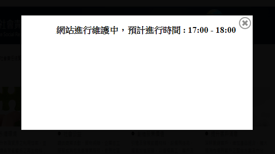

## Background

在之前的範例 [04.Embed Google Map](https://github.com/KarateJB/eBooks/tree/master/AngularJS/04.%20Embed%20Google%20map) 的應用
內嵌的Google map只會在顯示時取得使用者的視窗大小，再計算遮罩的大小；
與我們希望任何時候做 Window Resize便改變大小的需求變不符合了；

這時候就可以使用 `$watch` 監控當Window size改變時，我們也同時改變`Derective`的內容。


## Implement

以下圖說明，需求是要將遮罩上的資訊顯示在整個瀏覽器的中央，且大小會隨瀏覽器大小改變大小和相對位置。





#### Html

簡化重點的HTML如下，
在DIV綁上一個名稱為 **resize** 的`directive`， 並且指定 `ng-style`。

```
<div  id="overlayWrapper" class="overlay-wrapper" ng-style="overlayStyle"  resize>
     <span> {{SiteMessage}} </span>
</div>
```

#### JS

```
var app = angular.module('app', [])
.directive('resize', function ($window) {

    return function (scope, element) {

        var w = angular.element($window);
        scope.getWindowDimensions = function () {
            return {
                'h': w.height(),
                'w': w.width()
            };
        };
        scope.$watch(scope.getWindowDimensions, function (newValue, oldValue) {

            var windowHeight = newValue.h;
            var windowWidth = newValue.w;
            var overlayHeight = windowHeight / 3;
            var overlayWidth = windowWidth / 2;
            var top = 100;
            var right = windowWidth / 5;

            scope.overlayStyle =
            {
                position: 'fixed',
                display: 'block',
                opacity: 1,
                right: right + 'px',
                top: top + 'px',
                width: overlayWidth + 'px',
                height: overlayHeight + 'px'
            };

        }, true);

        w.bind('resize', function () {
            scope.$apply();
        });
    }
})
.controller('HomeCtrl', function ($scope) {
   // …
});
```

重點在於指定 resize 這個`directive`會監控(Watch) `$scope.getWindowDimensions` 的內容，當其內容值發生改變時，便會執行對應的內容 => 亦即改變`ng-style`的內容。


## Reference
1. [http://jsfiddle.net/jaredwilli/SfJ8c/](http://jsfiddle.net/jaredwilli/SfJ8c/)
