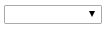

## Introduction

Refers to
[AngularJS guide](https://docs.angularjs.org/api/ng/directive/select) and
[StackFlow : How to set the value property in AngularJS' ng-options?](http://stackoverflow.com/questions/12139152/how-to-set-the-value-property-in-angularjs-ng-options)

We have several ways to implement the DropDownList with AngularJS.


> **for array data sources:**
>
> 1. `label for value in array`
> 2. `select as label for value in array`
> 3. `label group by group for value in array`
> 4. `select as label group by group for value in array track by trackexpr`

> **for object data sources:**
>
> 1. `label for (key , value) in object`
> 2. `select as label for (key , value) in object`
> 3. `label group by group for (key, value) in object`
> 4. `select as label group by group for (key, value) in object`


However, I encountered some problems with it.
Here I will provide a correct way to make a DropDownList (`<select>` in HTML) with dynamic options and ng-model binding.


## Samples

### Goals

I want to create a DropDownList with dynamic options, which contains a “Please select” as default. When user select a different option excepts “Please select”, the label of the selected value will appear in the webpage.


#### Failed Attempt

Sounds easy, right? I wrote something incorrect like the following codes. (See [sample codes](http://codepen.io/KarateJB/pen/JGGqaa) HERE)

```
<div ng-app="app" ng-controller="CustomerCtrl">
  <select ng-model="InChargeId" ng-change="ChangeChargeId()" ng-options="option.CustomerId as option.Title for option in CustomerOptions track by option.CustomerId" />
  <input type="text" ng-show="ShowCustomer" ng-model="InCharge" text="{{InCharge}}" />
</div>
```

And I try to control the selected value by writing :

```
$scope.InChargeId = 'Default';
```

But default value did not shown when initializing.




and selected value disappeared in the DropDownList


#### Correct Attempt

The most important thing is that we have to treat the option as an object!
The default value and other options are Objects, so as the `ng-model` of select.

Furthermore, remove `option.CustomerId as …` when using `track by`.

This is the correct codes in HTML:

```
ng-options="option.Title for option in CustomerOptions track by option.CustomerId"
```

And use object reference to assign the default value!

```
$scope.InChargeId = $scope.CustomerOptions[0];
```

([See sample codes HERE](http://codepen.io/KarateJB/pen/dGGwqZ))


## Reference
1. [AngularJS guide](https://docs.angularjs.org/api/ng/directive/select)
2. [StackFlow : How to set the value property in AngularJS' ng-options?](http://stackoverflow.com/questions/12139152/how-to-set-the-value-property-in-angularjs-ng-options)