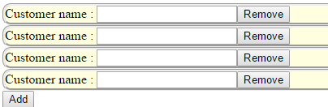

## Introduction
I will show 2 samples which using `ngBindHtml` and Append method for appending some Html on run-time.
Furthermore, there are Angular service on the dynamic Html, so we have to make sure that the functions work well when the html is shown on the page.


## Implement


### Preview result

Click “Add” to append the input block, and click “Remove” to remove one of the blocks.




### Using ngBindHtml

* Html

```
<div ng-app="app" ng-controller="MyCtrl">
    <div id="CustomerDivCollection" ng-bind-html="DivCustomers" compile-template>

    </div>
    <input type="button" value="Add" ng-click="AddCustomer()" />
</div>
```

Notice that if you want the angular service work on the dynamic html element, the element must be compiled by AngularJS. 
We will create a directive : `compile-template` and use `$compile` to compile the element.


* Js

Just set the html string to the `ngBindHtml`, however we have to use `$sce.trustAsHtml(html)`
to avoid the security errors (`[$sce:unsafe]`).

```
var app =
  angular.module('app', [])
  .directive('compileTemplate', function($compile, $parse) {
    return {
      link: function(scope, element, attr) {
        var parsed = $parse(attr.ngBindHtml);

        function getStringValue() {
          return (parsed(scope) || '').toString();
        }

        //Recompile if the template changes
        scope.$watch(getStringValue, function() {
          $compile(element, null, -9999)(scope); //The -9999 makes it skip directives so that we do not recompile ourselves
        });
      }
    }
  })
  .controller('MyCtrl', function($scope, $sce, $compile) {

    $scope.customerDivIndex = 1;
    $scope.DivCustomers = $sce.trustAsHtml("<b>Click [Add] to create a new customer input block!</b><br /><br /><br />");

    $scope.AddCustomer = function() {

      var divId = "CustomerDiv" + $scope.customerDivIndex;
      $scope.customerDivIndex++;

      var preAppendDiv = "<div style='border:groove; background-color:lightyellow; border-radius: 10px 10px 10px 10px;' id='" + divId + "'>";
      var block = "Customer name : <input type='text' id = 'CustomerName' value = '' / >";
      var postAppendDiv = "<input type='button' value='Remove' ng-click='RemoveCustomerDiv(\"" + divId + "\")' /></div>";

      $scope.DivCustomers = $sce.trustAsHtml($scope.DivCustomers + preAppendDiv + block + postAppendDiv);

    }

    //Notice this method hasn't be finished yet.
    //It just remove the item from front-end but not the ngBindHtml
    $scope.RemoveCustomerDiv = function(divId) {
      var myEl = angular.element(document.querySelector('#' + divId));
      myEl.remove(); //removes element
    }

  });
```

([See sample codes HERE](http://codepen.io/KarateJB/pen/NxdZbJ))


## Using Append

I prefer using Append that has more control on the dynamic html.

* Html

```
<div ng-app="app" ng-controller="MyCtrl">
    <div id="CustomerDivCollection" ng-bind-html="DivCustomers" compile-template>

    </div>
    <input type="button" value="Add" ng-click="AddCustomer()" />
</div>
```

* JS

```
var app =
  angular.module('app', [])
  .controller('MyCtrl', function ($scope, $sce, $compile) {

      $scope.customerDivIndex = 1;

      $scope.AddCustomer = function () {

          var divId = "CustomerDiv" + $scope.customerDivIndex;
          $scope.customerDivIndex++;

          var preAppendDiv = "<div style='border:groove; background-color:lightyellow; border-radius: 10px 10px 10px 10px;' id='" + divId + "'>";
          var block = "Customer name : <input type='text' id = 'CustomerName' value = '' / >";
          var postAppendDiv = "<input type='button' value='Remove' ng-click='RemoveCustomerDiv(\"" + divId + "\")' /></div>";


          var myEl = angular.element(document.querySelector('#CustomerDivCollection'));
          myEl.append($compile(preAppendDiv + block + postAppendDiv)($scope));

          /*The following codes need jQuery*/
          //var $el = $(preAppendDiv + block + postAppendDiv).appendTo('#CustomerDivCollection');
          //$compile($el)($scope);

      }

      $scope.RemoveCustomerDiv = function (divId) {
          var myEl = angular.element(document.querySelector('#' + divId));
          myEl.remove(); //removes element
      }
  });
```
  
 ([See sample codes HERE](http://codepen.io/KarateJB/pen/dGNBRZ))


