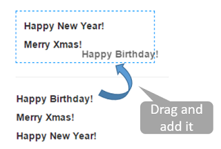

## Introduction
There are many drag-and-drop samples with HTML5, and few of them are written with AngularJS.
I prefer these two solutions to complete the job :)

1. [Native HTML5 directive with pure AngularJS](https://github.com/angular-dragdrop/angular-dragdrop) (Author : [Ganaraj P R](https://github.com/ganarajpr))
2. Using [jQueryUI](http://codef0rmer.github.io/angular-dragdrop/#/)

I will make a sample with solution 1 for
1.  Drag labels from a list to the DIV.
2.  Remove any label in the DIV by drag it back to the list.

 



## Implement

* HTML

```
<style type="text/css">
    .drop-box {
        width: 200px;
        padding: 10px;
        border: 1px #0094ff dashed;
        /*float: left;*/
        margin-top: 30px;
    }
</style>

<div ng-app="app" ng-controller="Html5IndexCtrl">
    <div id="DivBox" class="drop-box" ui-on-Drop="OnDrop($event,$data,DropWishes)">
        <table>
            <tr ng-repeat="element in DropWishes track by $index">
                <td>
                    <label  drag="element" ui-draggable="true" on-drop-success="DropSuccess($event, $index, DropWishes)">{{element}}</label>
                </td>
            </tr>

        </table>
    </div>
    <hr />
    <div ui-on-Drop="OnDrop($event,$data)" >
        <table>
            <tr ng-repeat="element in Wishes track by $index">
                <td>
                    <label drag="element" ui-draggable="true">{{element}}</label>
                </td>
            </tr>
        </table>
    </div>
</div>
```


For those elements you want to drag, put `drag` and `ui-draggable` directives within it.
And add the `ui-on-Drop` event on the element which can be dropped with a drag-gable element.

Furthermore, if you want to have a callback  (in this example,  removing the element) after drag and drop it, add an event : `on-drop-success`.


* JS

[Ganaraj P R](https://github.com/ganarajpr)‘s [draganddrop.js](https://github.com/ganarajpr/angular-dragdrop/blob/master/draganddrop.js) is a must! Don’t forget to include it.

```
var app =
angular.module('app', ['ang-drag-drop'])
.controller('Html5IndexCtrl', function ($scope) {

    $scope.Wishes = ['Happy Birthday!', 'Merry Xmas!', 'Happy New Year!'];
    $scope.DropWishes = [];


    $scope.DropSuccess = function ($event, index, array) {
        array.splice(index, 1);
    };
    $scope.OnDrop = function ($event, $data, array) {
        if (array != null) {
            array.push($data);
        }
    };
});
```

## Reference
1. [Native HTML5 directive with pure AngularJS](https://github.com/angular-dragdrop/angular-dragdrop)


