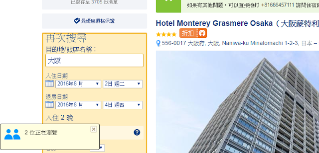

## Background
I was implementing a function like the pop-up message on [Booking.com](https://www.booking.com/index.zh-tw.html?label=gen173nr-1DCAEoggJCAlhYSDNiBW5vcmVmaOcBiAEBmAEwuAEGyAEM2AED6AEBkgIBeagCAw;sid=ceefe74a342b992fe4495d373a110617;dcid=1;sb_price_type=total&)
Referring to the following picture, we can see the pushed message from server-side and the message disappear within 3 – 5 seconds.



In .NET application, we can use `SignalR` to make a good practice of server-side pushing messages.

For the pop-up messages on front-end, we can use AngularJS service : [$interval](https://docs.angularjs.org/api/ng/service/$interval) to set an interval of the messages.


## Implement


* HTML

```
<div ng-app="app" ng-controller="HomeCtrl">
    <div class="div-left-bottom" ng-hide="IsHideDivBroadcast">
        <ul ng-repeat="item in BroadcastMsgs">
            <li>{{item.User}}&nbsp;{{item.Message}}</li>
        </ul>
    </div>
</div>
```

* CSS

```
.div-left-bottom {
width:150px;
float:left;
position:fixed;
left:0px;
bottom:0px;
z-index:20;
background-color:lightgrey;
border:2px solid #69c;
_position:absolute; /* position fixed for IE6 */
}

.div-left-bottom li {
font-size:10px;
font-family:"Consolas";
}
```

* JS

```
var app =
  angular.module('app', [])
  .controller('HomeCtrl', function ($scope, $interval) {

      //Variables
      $scope.BroadcastMsgs = []; //Broadcast messages
      var broadcastIntervalPromise; //The promise for broadcasting messages

      /* Starts the interval */
      $scope.startBroadcastInterval = function () {
          $scope.IsHideDivBroadcast = false;

          // stops any running interval to avoid two intervals running at the same time
          $scope.stopBroadcastInterval();
          // store the interval promise
          broadcastIntervalPromise = $interval(resetBroadcastMsgs, 1000 * 6);
      };
      /* Stops the interval */
      $scope.stopBroadcastInterval = function () {
          $interval.cancel(broadcastIntervalPromise);
      };

      /* Stop the interval when the scope is destroyed  */
      $scope.$on('$destroy', function () {
          $scope.stopBroadcastInterval();
      });

      /* Clear the braodcast messages*/
      function resetBroadcastMsgs() {
          $scope.BroadcastMsgs = [];
      }


      //Testing from here --------------------------------------
      //Start the interval
      $scope.startBroadcastInterval();


      $scope.BroadcastMsgs.push({
          "User": "JB",
          "Message": "reserved a room!"
      })
      $scope.BroadcastMsgs.push({
          "User": "Lily",
          "Message": "reserved 2 rooms!"
      })
      //Testing ends here --------------------------------------

  });
```

> `broadcastIntervalPromise = $interval(resetBroadcastMsgs, 1000 * 6)`  :
> ===>  **Set an 6 secs interval for triggering the function : resetBroadcastMsgs**


([See sample codes on CodePen](http://codepen.io/KarateJB/pen/vGrGye))


## Reference
1. [StackOverflow : How to clear or stop timeInterval in angularjs?](http://stackoverflow.com/questions/26447923/how-to-clear-or-stop-timeinterval-in-angularjs)