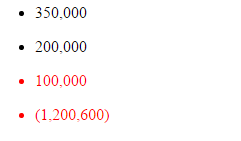

## Background

There was a requirement which asked for showing different style (template) on numbers.
For example, the number must be shown with red color, while it is lower than a minimum number.

The numbers are [350000, 200000, 100000, -1200600]
Minimum value is 120000.

Expected result is as following.


 

## Implement


### Directive

```
var app =
  angular.module('app', [])
  .directive('monitorNumber', function ($compile, $filter) {

      var getTemplate = function (isWarning, current) {

          //Convert the negative number

          if (isWarning == true) {
              if (current < 0) {
                  return "<li class='warning'>({{ (0-current) | number}})</li>";
              } else {
                  return "<li class='warning'>{{current | number}}</li>";
              }
          } else {
              return "<li>{{current | number}}</li>";
          }
      }

      return {
          restrict: 'E', //This directive can be a new HTML element
          scope: {
              current: "=",
              min: "="
          },
          //template : '<div>Hello!</div>',
          link: function ($scope, $element, $attrs) {

              var isWarning = false;
              if ($scope.current <= $scope.min) {
                  isWarning = true;
              }
              var el = $compile(getTemplate(isWarning, $scope.current))($scope);
              $element.replaceWith(el);
          },
          controller: function ($scope, $element) {

          }

      };
  })
```


Declare two input parameter for the directive : `current` and `min`.
Use `$element` to find the DOM and replace it with the returned template.


And how to use the directive...

* Controller

```
var app =
  angular.module('app', [])
    .controller('FilterCtrl', function ($scope) {
        var self = this;
        self.Numbers = [350000, 200000, 100000, -1200600];
    })
```


* HTML

```
<div ng-app="app" ng-controller="FilterCtrl as Ctrl">
    <ul ng-repeat="item in Ctrl.Numbers">
        <monitor-number current=item min=120000 />
    </ul>
</div>
```


([See sample codes in CodePen](http://codepen.io/KarateJB/pen/jqdVpy))

