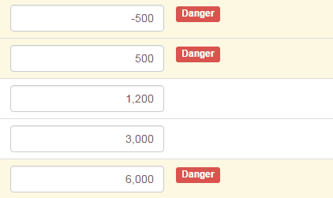

## Background

Extend the example in the previous article, 

[15. Create directive (3) - dynamic template](https://github.com/KarateJB/eBooks/tree/master/AngularJS/15.%20Create%20directive%20(3)%20-%20dynamic%20template)

We are going to make another sample with monitor the number in the Textbox. 
If the number in the textbox exceeds the tolerable maximum value or is smaller than the minimum value, we will warn the users like the following GIF.





So the directive will contains these functions:
1. Add/remove CSS class on different condition.
2. Append/remove HTML on DOM on different condition.
3. Inject the ngModel directive.
4. Implement the `Change` event of Textbox and monitor the value.


## Implement


### Directive

```
angular.module('app', [])
  .directive('monitorNumber', function ($compile, $filter) {

      return {
          restrict: 'AE',
          scope: {
              max: "=",
              min: "=",
              index: "=",
              current: "="
          },
          require: 'ngModel',
          link: function ($scope, $element, $attr, Ctrl) {

              function monitor(current, min, max, index) {

                  var warningSpanId = "span" + index.toString();

                  if (current <= min || current >= max) {

                      //Add the CSS
                      $element.addClass("warning");

                      //Append an element
                      var warningSpan = document.querySelector("#" + warningSpanId);

                      if (warningSpan == null) {
                          var el = angular.element("<span id='" + warningSpanId + "' class='label label-danger'>Danger</span>");
                          $element.append(el);
                      }

                  } else {
                      $element.removeClass("warning");
                      var warningSpan = document.querySelector("#" + warningSpanId);
                      if (warningSpan != null) {
                          warningSpan.remove();
                      }
                  }
              }

              //For monitoring first data-binding value,
              //$viewValue and $modelValue havn't be rendered here, so use $scope.current  
              monitor($scope.current, $scope.min, $scope.max, $scope.index);

              /*
              *  Change event => monitor the value again
              */
              $element.bind("change", function () {

                  if (Ctrl.$invalid) return;

                  monitor(Ctrl.$modelValue, $scope.min, $scope.max, $scope.index);
              });
          },
          controller: function ($scope, $element) {

          }

      };
  })
```

**Restrict** :
`E` (element), `A` (Attribute), `C` (Class) and `M` (Comment). The default value is `A`.

**Require** :
What gives you the controller for the other directive.


### Usage

* JS

```
angular.module('app', [])
  .controller('FilterCtrl', function ($scope, $filter) {
      var self = this;
      self.Numbers = [-500, 500, 1200, 3000, 6000];
  })
```


* HTML

```
<div ng-app="app" ng-controller="FilterCtrl as Ctrl">
    <table class="table">
        <tbody>
            <tr ng-repeat="item in Ctrl.Numbers">
                <td ng-model="item" monitor-number  index="$index" current=item min=1000 max=5000>
                    <div class="col-md-2">
                        <input number-input type="text" ng-model="item" class="form-control text-right" />
                    </div>
                </td>
            </tr>
        </tbody>
    </table>
</div>
```

Be aware that where the `monitorNumber` should be put, for the directive will append Html on the element.
In the case, I put the directive on the `td` element but not the `textbox`, cus I want append the Html on `td`.


([See sample codes on CodePen](http://codepen.io/KarateJB/pen/eZxKyR))
