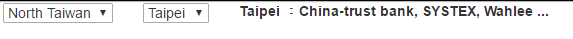
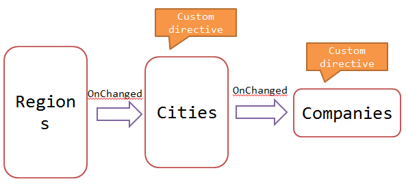

## Introduction

There a lot of situations that we might use multiple directives in a web page, 
and they have some relations among them. 
In this example, I created two directives and CONNECTED them.


The key point is passing `ngModel` with **two-way binding** between these directives.


## Implement

Refer to the following picture, I have 2 drop-down-lists and 1 display label.

1. Regions
2. Cities
3. What companies in the selected city






  

### Regions

* HTML

```
<select ng-model="Region" ng-change="ChangeChargeId()" ng-options="option.Name for option in RegionOptions track by option.Id" />
```

* JS

```
var app = angular.module('app', [])
  .controller('AppCtrl', function ($scope) {
      $scope.RegionOptions = [{
          'Id': 1,
          'Name': 'North Taiwan'
      }, {
          'Id': 2,
          'Name': 'South Taiwan'
      }];
  })
```


### Cities

Create a directive for "Cities". However, the cities drop-down-list would be changed after the "Region" changes. 
So we pass the `$scope.Region` to the isolated scope of the directive for two-way binding.

* HTML

```
<my-city ng-model="Region" selectcity="MyCity" />
```

* JS

```
app.directive('myCity', function ($filter) {
        return {
            //restrict: "A",
            scope: {
                Region: "=ngModel",
                selectcity: "="
            },
            template: "<select ng-model='City' ng-change='ChangeCity()' ng-options='option.Name for option in CityOptions track by option.Id' />",
            link: function ($scope, $element) {

                $scope.filterCities = function (regionId) {
                    var cityOpts = $filter('filter')($scope.AllCityOptions, {
                        RegionId: regionId
                    }, true);
                    $scope.CityOptions = cityOpts;
                }

                $scope.AllCityOptions = [
                    { 'Id': 1, 'Name': 'Taipei', 'RegionId': 1 },
                    { 'Id': 2, 'Name': 'Linkou', 'RegionId': 1 },
                    { 'Id': 3, 'Name': 'Tainan', 'RegionId': 2 },
                    {'Id': 4,'Name': 'Kaohsiung','RegionId': 2}];

                $scope.$watch("Region", function (newValue, oldValue) {
                    if (newValue != null && newValue != {}) {
                        $scope.filterCities($scope.Region.Id);
                    }
                });

                $scope.ChangeCity = function () {
                    $scope.selectcity = $scope.City;
                };

            }
        }
    })
```

> Tips,
>
> 1. `$watch` `scope.Region` which is two-way-binding from the "Region" drop-down-list.
> 2. Set the value of `$scope.MyCity`, which is two-way binding as well. We will use this `ngModel` in the next directive.


### Companies

* HTML

```
<my-company selectcity="MyCity">
```

* JS

```
app.directive('myCompany', function () {
        return {
            //restrict: "A",
            scope: {
                selectcity: "="
            },
            template: "<span>{{companies}}</span>",
            link: function ($scope, $element) {
                $scope.$watch("selectcity", function (newValue, oldValue) {
                    if (newValue != null && newValue != {}) {
                        var companies = "";
                        switch ($scope.selectcity.Name) {
                            case "Taipei":
                                companies = "China-trust bank, SYSTEX, Wahlee ...";
                                break;
                            case "Linkou":
                                companies = "Inotera memories ...";
                                break;
                            case "Tainan":
                                companies = "TSMC, Chimei ...";
                                break;
                            case "Kaohsiung":
                                companies = "Foxconn ...";
                                break;
                        }

                        $scope.companies = companies;
                    }
                });
            }
        }
    })
```


([See sample codes on CodePen](http://codepen.io/KarateJB/pen/jrEZaB))