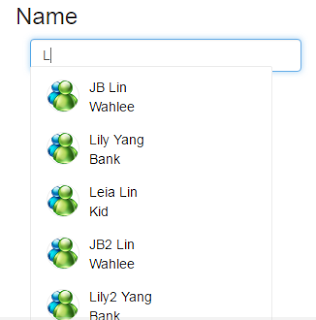
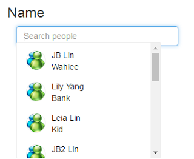

## Introduction

[AnguComplete-alt](https://github.com/ghiden/angucomplete-alt) 是可以實作Auto-complete(自動完成)的angularjs directive。
It forks from [AnguComplete](https://github.com/darylrowland/angucomplete).

至於[AnguComplete-alt](https://github.com/ghiden/angucomplete-alt)相比之下，我覺得以下多出來的功能很重要： (Extra features請參考作者[ghiden](https://github.com/ghiden/)的說明)

1.  A callback for tracking input changes
2.  Show scrollbar
3.  Custom remote API handler
4.  Can show all data when input nothing

基本的操作，就請參考原作者的[GitHub](https://github.com/ghiden/angucomplete-alt)和[Demo page](https://ghiden.github.io/angucomplete-alt/)。
以下另外說明一些我比較常用的操作。


## Implement

* HTML

```
<div ng-app="app" ng-controller="AnguAltCtrl">
    <h3>Name</h3>
    <div class="col-md-5">
        <angucomplete-alt id="ex2" placeholder="Search people"
                          pause="100"
                          selected-object="selectedPerson"
                          local-data="people"
                          search-fields="firstName,surname"
                          title-field="firstName,surname"
                          description-field="company"
                          image-field="pic" minlength="1"
                          input-class="form-control  form-control-small"
                          match-class="highlight" />
    </div>
</div>
```


* js

```
var app =
angular.module('app', ['angucomplete-alt'])
.controller("AnguAltCtrl", function ($scope, $http) {

    var imgUrl = "../../Content/images/gif/msn.gif";

    $scope.people = [
            { firstName: "JB", surname: "Lin", company: "Wahlee", pic: imgUrl },
            { firstName: "Lily", surname: "Yang", company: "Bank", pic: imgUrl },
            { firstName: "Leia", surname: "Lin", company: "Kid", pic: imgUrl },
            { firstName: "小翰", surname: "林", company: "Wahlee", pic: imgUrl },
            { firstName: "小儀", surname: "楊", company: "Bank", pic: imgUrl },
            { firstName: "小臻", surname: "林", company: "Kid", pic: imgUrl }
    ];
});
```

執行結果如下，另外中文也是可以支援的。 不過因為輸入法的關係，當輸入中文字後，必須再按一個按鍵才會帶出自動完成的資料。 
PS. 我是習慣按空白鍵。



 


### Feature : 不輸入值的情況下，帶出所有自動完成資料

作者很貼心的在issue 107加上了這個功能，我們只要將minlegth = 0 就可以了。

```
<angucomplete-alt id="ex2" placeholder="Search people"
                          pause="100"
                          selected-object="selectedPerson"
                          local-data="people"
                          search-fields="firstName,surname"
                          title-field="firstName,surname"
                          description-field="company"
                          image-field="pic"
minlength="0"
                          input-class="form-control  form-control-small"
                          match-class="highlight" />
```


### Feature : 加上Scroll bar

打開`angucomplete-alt.css`， 在`.angucomplete-dropdown` 加入以下CSS設定 : 

1. overflow-y: auto
2. max-height: 200px

```
.angucomplete-dropdown {
    border-color: #ececec;
    border-width: 1px;
    border-style: solid;
    border-radius: 2px;
    width: 250px;
    padding: 6px;
    cursor: pointer;
    z-index: 9999;
    position: absolute;
    margin-top: -6px;
    background-color: #ffffff;

    overflow-y: auto;
    max-height: 200px;
}
```




## Reference
1. [AnguComplete](https://github.com/darylrowland/angucomplete)
2. [AnguComplete-alt](https://github.com/ghiden/angucomplete-alt)