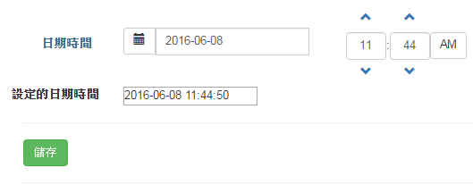

## Introduction

[Angular-ui-bootstrap](http://angular-ui.github.io/bootstrap/) 提供了以bootstrap為主的 directives.
以下記錄其中兩個directive的實際應用。

* datepicker-popup
* timepicker


## Environment
* angular-ui-bootstrap 1.3.3

> 注意! 由於angular-ui-bootstrap使用了很多template html，在ui-bootstrap.js檔裡面定義了這些Html的路徑。 如果不想一個一個去更改路徑的話，可直接引用 `ui-bootstrap-tpls.js`
> 
> 請參考：[`ui-bootstrap-tpls.min.js == (ui-bootstrap.min.js + html templates)`](http://stackoverflow.com/questions/19820625/what-is-the-difference-between-ui-bootstrap-tpls-min-js-and-ui-bootstrap-min-js)


## Implement

### 完成畫面



### HTML - datepickerPopup

```
<p class="input-group">
<span class="input-group-btn">
<button type="button" class="btn btn-default" ng-click="open()">
        <i class="glyphicon glyphicon-calendar"></i>
</button>
</span>
<input type="text" class="form-control" ng-click="open()" uib-datepicker-popup ng-model="ScheduleDatetime" is-open="popup.opened" datepicker-options="dateOptions" ng-required="true" close-text="Close" />
</p>
```

> ===> [參數設定參考](http://angular-ui.github.io/bootstrap/#/datepickerPopup)

其中比較重要的是`datepicker-options`是這個參數，它指定了要設定的格式； 可以參考 javascript的部分。


### HTML - timepicker

```
<uib-timepicker ng-model="ScheduleDatetime" ng-change="changed()" hour-step="hstep" minute-step="mstep" show-meridian="ismeridian"></uib-timepicker>
```

> ====> [參數設定參考](http://angular-ui.github.io/bootstrap/#/timepicker)

`hour-step` 和 `minute-step`是指定使用 "上"、"下" 按鈕每次累加的數字。
`show-meridian`： 是否顯示AM/PM； 如果為false就代表是 24小時制。


* JS

```
angular.module('app', ['ui.bootstrap'])
.controller('DateTimeCtrl', function ($scope) {

    /*
     * Datepicker
     */
    $scope.today = function () {
        $scope.ScheduleDatetime = new Date();
    };

    $scope.today();

   
    $scope.dateOptions = {
        dateDisabled: disabled, //指定不能選擇星期幾，例如此例的 0 : Sunday, 6 : Saturday
        formatYear: 'yy',
        maxDate: new Date(2020, 5, 22), //The max day that could be selected
        minDate: new Date(), //The min day that could be selected
        startingDay: 1  //Starting from 1. Monday, 2. Tuesday (2) …
    };

    // Disable weekend selection
    function disabled(data) {
        var date = data.date,
          mode = data.mode;
        return mode === 'day' && (date.getDay() === 0 || date.getDay() === 6);
    }


    $scope.open = function () {
        $scope.popup.opened = true;
    };


    $scope.popup = {
        opened: false
    };

    /*
     * Timepicker
     */
    $scope.ismeridian = true;
    $scope.hstep = 1;
    $scope.mstep = 15;
});
```

> 只要指定datepickerPopup和timepicker是同一個ngModel，則angular會自動將日期和時間一起指定給這個ngModel。


最後，如果是從後端丟到前端的日期時間，例如.NET的`System.DateTime`，一定要在前端先轉成javascript的`Date`!  
如下例，我先用`razor`帶出後端的`ViewBag.defaultDatetime` : `System.DateTime`

為了要正確顯示於前端，利用`ConvertDate`這個函式，將其轉換為javascript date。
最後再用`$filter`顯示為 "2016-06-08 02:09:11"

* HTML

```
@{
     var scheduleDatetime = ViewBag.defaultDatetime == null ?
     DateTime.Now.ToString("yyyy/MM/dd HH:mm:ss") : ViewBag.defaultDatetime.ToString("yyyy/MM/dd HH:mm:ss");
}

<td><label class="control-label">設定的日期時間</label></td>
<td colspan="2">
    <input type="text" name="ScheduleDatetime" value="{{ScheduleDatetime | date:'yyyy-MM-dd HH:mm:ss'}}" ng-init="ScheduleDatetime = ConvertDate('@scheduleDatetime')" />
</td>
```

* JS

```
//Convert string (ex. yyyy/MM/dd HH:mm:ss) to a javascript datetime
$scope.ConvertDate = function (dateStr) {
        var date = new Date(dateStr);
        return date;
}
```


## Reference
1. [Angular-ui-bootstrap](http://angular-ui.github.io/bootstrap/)
