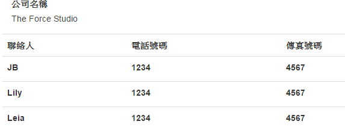

## Introduction

So how to quickly ngInit with a ViewModel in .NET MVC?
The answer is using **JSON serialization**!


## Sample

### MVC : ViewModel

```
public class VmCustomers
{
        [DisplayName("公司名稱")]
        public string CompanyName { get; set; }

        public List<VmCustomer> Customers { get; set; }

        public VmCustomers()
        {
            this.Customers = new List<VmCustomer>();
        }
}
```

```
public class VmCustomer
{
        [DisplayName("聯絡人")]
        public string InCharge { get; set; }
        [DisplayName("電話號碼")]
        public string Phone { get; set; }
        [DisplayName("傳真號碼")]
        public string Fax { get; set; }
        public bool WillBeSaved { get; set; }

}
```


### MVC : Action

```
public ActionResult Index()
{
     var customers = new VmCustomers();
     customers.CompanyName = "The Force Studio";
     customers.Customers = new List<VmCustomer>() {
         new VmCustomer {  Sn = 0,InCharge="JB", Phone="1234", Fax="4567", WillBeSaved=true},
         new VmCustomer {  Sn = 1,InCharge="Lily", Phone="1234",Fax="4567", WillBeSaved=false},
         new VmCustomer {  Sn = 2,InCharge="Leia", Phone="1234",Fax="4567", WillBeSaved=false}
     };


     return View(customers);
}
```

### MVC : View (Html)

> Use [Newtonsoft.Json(Json.NET)](https://www.nuget.org/packages/newtonsoft.json/) to serialize the ViewModel and use [ngInit](https://docs.angularjs.org/api/ng/directive/ngInit) to initialize the javascript object. 

```
@model VmCustomers
@using Newtonsoft.Json

<div ng-app="app" ng-controller="Ctrl">
<table class="table" ng-init="InitCustomers(@JsonConvert.SerializeObject(Model))">
        <tr>
            <th>
                @Html.DisplayNameFor(model => model.Customers.First().InCharge)
            </th>
            <th>
                @Html.DisplayNameFor(model => model.Customers.First().Phone)
            </th>
            <th>
                @Html.DisplayNameFor(model => model.Customers.First().Fax)
            </th>
        </tr>

        <tr ng-repeat="item in customers" >
            <td><label>{{item.InCharge}}</label></td>
            <td><label>{{item.Phone}}</label></td>
            <td><label>{{item.Fax}}</label></td>
        </tr>

</table>
</div>
```

### JS

```
angular.module("app", [])
.controller('Ctrl', function ($scope) {
    $scope.customers = [];

    $scope.InitCustomers = function (data) {
        $scope.customers = data.Customers;
    }
})
```

### Result




