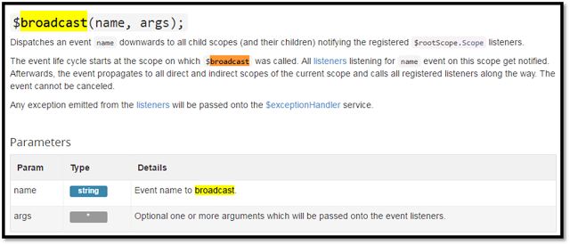
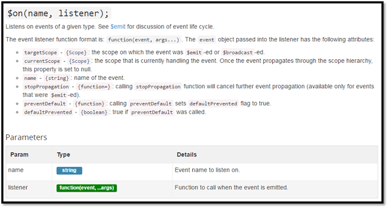
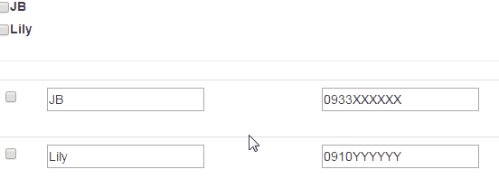

## Introduction

From [AngularJS Document](https://docs.angularjs.org/api/ng/type/$rootScope.Scope), we can use `$on` to listen an event in child scope and use `$broadcast` to trigger an event in parent scope.



(From [Angular Official document](https://docs.angularjs.org/api/ng/type/$rootScope.Scope))




(From [Angular Official document](https://docs.angularjs.org/api/ng/type/$rootScope.Scope))


In the following sample, I will create a custom directive and use `$broadcast` and `$on` to change the value inside the directive when something changed in parent scope.


## Implement

### Goal

There are checkboxes with `ng-repeat` data. When the checkbox is checked/un-checked, the parent scope will trigger(broadcast) an event to the directive below, and make the checkbox checked/un-checked and highlighed/un-highlighted inside the directive.





* Html

```
<div ng-app="app" ng-controller="AppCtrl">
    <div>
        <table class="list">
            <tr ng-repeat="item in Customers">
                <td>
<input type="checkbox"
ng-checked="item.IsChecked"
ng-click="setChecked(item)">
</td>
                <td><label class="control-label">{{item.Name}}</label></td>
            </tr>
        </table>
    </div>
    <hr />
    <div ng-repeat="item in Customers">
        <angu-customer ng-model="item" id="{{item.Id}}" />
    </div>
</div>
```


* Directive

```
angular.module('app', [])
.directive('anguCustomer', function ($http, $q) {
    var templatehtml = '<table class="table" ng-class="customClass">' +
      '<tr><td><input type="checkbox" ng-checked="IsChecked" /></td><td>' +
      '<input type="text" ng-model="Customer.Name" value="{{Customer.Name}}" />' +
      '</td><td>' +
      '<input type="text" ng-model="Customer.Phone" value="{{Customer.Phone}}" />' +
      '</td></tr></table>';

    return {
        scope: {
            Customer: "=ngModel",
            id: "@"
        },
        template: templatehtml,
        link: function ($scope, $element) {
            $scope.$on('customer:setChecked', function (event, elementId, value) {
                if (elementId === $scope.id) {
                    if (value == true) {
                        $scope.customClass = "highlight";
                        $scope.IsChecked = true;
                    } else {
                        $scope.customClass = "";
                        $scope.IsChecked = false;
                    }
                }
            });
        },
        controller: function ($scope, $element) {
        }
    }
})
```

> 1. The directive has a listener for event : `customer:setChecked`
> 2. Send `elementId` to make sure that the callback inside the listener only works on ONE element, but NOT ALL of the elements using this directive.


* JS (Parent scope)

```
angular.module('app', [])
.controller('AppCtrl', function ($scope) {
    var scope = $scope;
    scope.setChecked = function (customer) {
        customer.IsChecked = !customer.IsChecked;
        scope.$broadcast('customer:setChecked', customer.Id, customer.IsChecked);
    }
})
```

([See sample codes on CodePen](http://codepen.io/KarateJB/pen/VjdqQr))

