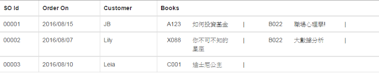
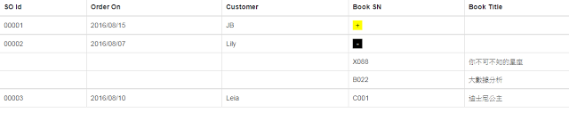

## Introduction

We have a master-details data, and we would like to display all the information in a HTML table. For example, a sales order contains several books within it. 
In this case, the sales order is the Master, and books are the Details.

(JSON for reference)
```
{'Id':'00001','Date':'2016/08/15','Customer':'JB','Books':[{'Id':'A123','Title':'BOOK1'},{'Id':'B022','Title':'BOOK2'}]}
```

In the following two demos, I will show how to use `ngIf`, `ngRepeat`, `ng-repeat-start/end` to format the master-details data on a HTML table.


## Demo

#### Demo 1



([See sample codes on CodePen](http://codepen.io/KarateJB/pen/yJkGaa)) 


#### Demo 2



([See sample codes on CodePen](http://codepen.io/KarateJB/pen/vKbVmN))  
 


## Reference
1. [if else statement in AngularJS templates](http://stackoverflow.com/questions/15810278/if-else-statement-in-angularjs-templates)
2. [AngularJS Multiple ng-repeats on single row of table](http://stackoverflow.com/questions/32570661/angularjs-multiple-ng-repeats-on-single-row-of-table)
