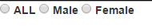
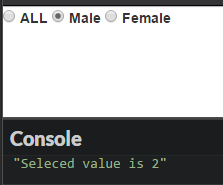
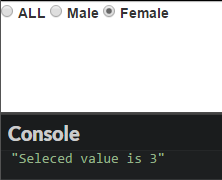
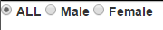

## Introduction

We are going to make radio buttons and get the selected value with `angularjs` in the following sample.
There are several ways to achieve the goal, however we can ignore `ngClick` in this clean way.


## Implement : First version

* HTML

```
<div ng-app="app" ng-controller="Ctrl">

    <div>
        <span ng-repeat="status in StatusOption.Options">
            <input type="radio" name="statusRadioButtons" />
            <label>{{status.Name}}</label>
        </span>
    </div>
</div>
```

* js

```
angular.module('app', [])
  .controller('Ctrl', function ($scope) {

      var statuses = [{
          'Id': '1',
          'Name': 'ALL',
          'IsSelected': true
      }, {
          'Id': '2',
          'Name': 'Male',
          'IsSelected': false
      }, {
          'Id': '3',
          'Name': 'Female',
          'IsSelected': false
      }];

      $scope.StatusOption = {
          'Options': statuses,
      };
})
```

Okay, the above codes will generate the following result.




## Implement : 2 way binding

We are going to modify the js and html with `ngModel` to support 2-way binding, so that we can get the seleceted value (option's id).

* Html

```
<div ng-app="app" ng-controller="Ctrl">
    <div>
        <span ng-repeat="status in StatusOption.Options">
            <input type="radio" value="{{status.Id}}" ng-model="StatusOption.SelectedId"
            <label>{{status.Name}}</label>
        </span>
    </div>
</div>
```


* js

We modify `$scope.StatusOption` with a new property : `SelectedId`, which is used to be the `ngModel` for keeping the value of the selected value of Radio buttons.

```
$scope.StatusOption = {
          'Options': statuses,
          'SelectedId': ""
      };
```


> NOTE!!!! If the `ngModel` set to another variable, not inside `$scope.StatusOption`, the 2-way binding won't work! 
> So we have to use  `$scope.StatusOption.SelectedId` as ngModel.






  

## Implement : default selected

In many cases, the Radio buttons must be initialized with a default selected radio button.
This can be done with ngChecked.


* HTML

```
<div ng-app="app" ng-controller="Ctrl">

    <div>
        <span ng-repeat="status in StatusOption.Options">
            <input type="radio" value="{{status.Id}}" ng-model="StatusOption.SelectedId"
                   ng-checked="status.Id==StatusOption.DefaultSelectedId" name="statusRadioButtons" />
            <label>{{status.Name}}</label>
        </span>
    </div>
</div>
```


 

([See sample codes on CodePen](http://codepen.io/KarateJB/pen/kXqNoj))
