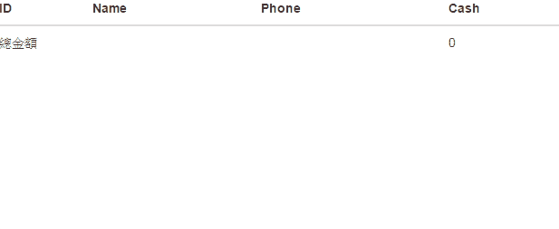
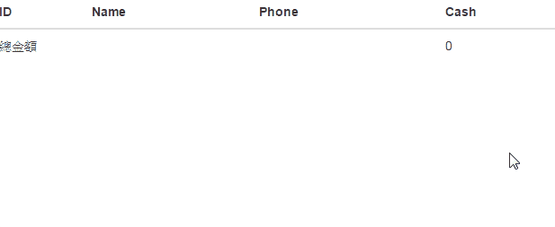
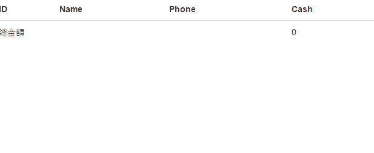

## Introduction

Though async calls (ajax) and callbacks are most useful way to implement front-end with javascript. 
We sometimes have to make the async function running as sequential function.
For example, we have an array with customers' id, and we are going to get the customers' information one by one from backend thru ajax. 
There are several ways to complete this requirement, we can get the data async asynchronously and sort the results based on the order of the original array. 
However, in the following sample, I will try to implement it by sending sequence requests.


## Implement

### Goal

We have an array with the customers' ids, and the final result will be displaying the customers' information thru async inquiry function but in the same order of the original id array. 
Futhermore, we want to summarize all the cash they have AFTER all the customers' information are responsed.


 ### Step 1 : async calls  (Sample code)

In step1, we will ignore the order of the result and just shows the customers' information thru async requests.

First, we simulate an async function for customer-information inquery with different response time.

* JS - service

```
angular.module('app', [])
  .service('getCustomers', function ($q, $timeout) {
      var data = [{
          'id': '1',
          'name': 'JB',
          'phone': '0933XXXXXX',
          'cash': 100
      }, {
          'id': '2',
          'name': 'Lily',
          'phone': '0910YYYYYY',
          'cash': 200
      }, {
          'id': '3',
          'name': 'Leia',
          'phone': '0982ZZZZZZ',
          'cash': 300
      }, {
          'id': '4',
          'name': 'hachi',
          'phone': '0955ZZZZZZ',
          'cash': 400
      }];

      var getdata = function (id) {

          var deferred = $q.defer();
          try {
              var randomTimeout = getRandomInt(1000, 3000); //The response time will be during 1sec-3sec
              $timeout(function () {
                  for (var i = 0; i < data.length; i++) {
                      var item = data[i];
                      if (item.id === id) {
                          deferred.resolve(item);
                          break;
                      }
                  }

              }, randomTimeout);
          } catch (err) {
              deferred.reject(err);
          }

          return deferred.promise;
      }

      function getRandomInt(min, max) {
          return Math.floor(Math.random() * (max - min + 1)) + min;
      }

      return getdata;
  })
```


* JS – controller

```
angular.module('app', [])
  .controller('DemoCtrl', function ($scope, $q, getCustomers) {
      $scope.customers = [];
      $scope.cashSum = 0;
      var searchIds = ['3', '4', '1', '2'];
      angular.forEach(searchIds, function (id) {

          var promise = getCustomers(id);
          promise.then((rtn) => {
              $scope.customers.push(rtn);
              $scope.cashSum += rtn.cash;
          });
      })
  })
```

* HTML

```
<div ng-app='app' ng-controller='DemoCtrl'>
    <table class="table">
        <thead>
            <tr>
                <th>ID</th>
                <th>Name</th>
                <th>Phone</th>
                <th>Cash</th>
            </tr>
        </thead>
        <tbody>
            <tr ng-repeat="cust in customers">
                <td>{{cust.id}}</td>
                <td>{{cust.name}}</td>
                <td>{{cust.phone}}</td>
                <td>{{cust.cash}}</td>
            </tr>
            <tr>
                <td colspan=3>總金額</td>
                <td>{{cashSum}}</td>
            <tr>
        </tbody>
        <tr>
    </table>
</div>
```

Okay, it's done the final result will be like the following snapshot. 
The order of the results will depends on the resposne time of each async call and the cash summary is called after each response.




* Step 2 : Summarize after all customers' requests response (Sample code)

In this step, we will use `$q.all` to make sure that all the requests are back and then trigger the summarize callback.

* JS - controller

```
angular.module('app', [])
  .controller('DemoCtrl', function ($scope, $q, $timeout, getCustomers) {
      $scope.customers = [];
      $scope.cashSum = 0;
      var searchIds = ['3', '4', '1', '2'];

      var promiseCollection = [];
      angular.forEach(searchIds, function (id) {

          var promise = getCustomers(id);
          promiseCollection.push(promise);

          promise.then((rtn) => {
              $scope.customers.push(rtn);
          });
      })

      $q.all(promiseCollection).then(() => {
              angular.forEach($scope.customers, function (cust) {
                  $scope.cashSum += cust.cash;
              })
      })

  })
```


Result : 




## Final step : Sequence reuquests (Sample code)

Here is the sample code of using recursive function for making sequential requests in a for-loop.

* JS – recursive sample

```
var index = 0;
next();

function next() {
    if (index < searchIds.length) {
        var promise = getCustomers(searchIds[index]);
        promise.then((rtn) => {
            $scope.customers.push(rtn);
            index++;
            next();
        });
    }
}
```

This is a smart way by using recursive method and callback to make the request be sent one by one (sequentially).

Now we can use the above method to modify our `js:controller`.


* JS – controller

```
angular.module('app', [])
  .controller('DemoCtrl', function ($scope, $q, $timeout, getCustomers, seqSearch) {
      $scope.customers = [];
      $scope.cashSum = 0;
      var searchIds = ['3', '4', '1', '2'];

      var deferred = $q.defer();
      var index = 0;
      next();

      function next() {
          if (index < searchIds.length) {
              var promise = getCustomers(searchIds[index]);
              promise.then((rtn) => {
                  $scope.customers.push(rtn);
                  index++;
                  next();
              });
          }
          else {
              deferred.resolve();
          }
      }

      deferred.promise.then(() => {
              angular.forEach($scope.customers, function (cust) {
                  $scope.cashSum += cust.cash;
              })
      })

  })
```

Notice that we don't need to use `$q.all` to wait all the customers' information requests because they are now sequence requests. Instead, we use a `deferred` (`$q.defer`) to promise that the recursive function is finished and then summarize the cash.

Final result is as following. The order of the result now is based on the order of the customers' id array. Cheeerrrrs!


