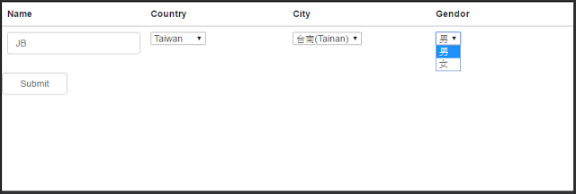
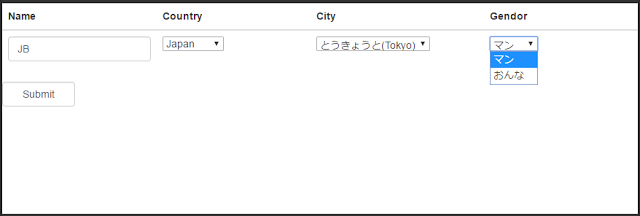
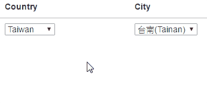
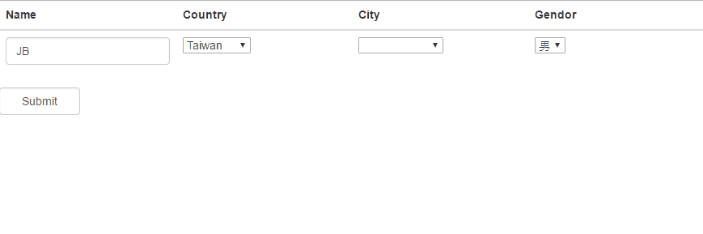

## Introduction

[$filter](https://docs.angularjs.org/api/ng/filter/filter) is one of the most useful service in angular. 
There some [filter components](https://docs.angularjs.org/api/ng/filter) already defined in angular. 
In this sample, I would like to show how to use [$filter](https://docs.angularjs.org/api/ng/filter/filter) for displaying different options of [ngOptions](https://docs.angularjs.org/api/ng/directive/ngOptions) which depends on another directive.


## Implement

### Goal

We will initialize all the data for ngOptions in the following drop-down-boxes.

1. Country
2. City
3. Gender

However, the options of City and Gender will be changed due to the selected value of Country. We will get this done by using $filter.

 



 
* JS

```
angular.module('app', [])
  .factory('optionFactory', function () {
      var factory = [];

      factory.getGenders = function () {

          var data = [{
              'id': 1,
              'nameEN': 'male',
              'nameZH': '男',
              'nameJP': 'マン'
          }, {
              'id': 2,
              'nameEN': 'female',
              'nameZH': '女',
              'nameJP': 'おんな'
          }];
          return data;

      };

      factory.getCountries = function () {

          var data = [{'id': 1,'name': 'Taiwan','local': 'ZH'}, {'id': 2,'name': 'American','local': 'EN'}, {'id': 3,'name': 'Japan','local': 'JP'}];
          return data;

      }

      factory.getCities = function () {

          var data = [{'id': 1,'name': '台北(Taipei)','countryId': 1}, {'id': 2,'name': '台南(Tainan)','countryId': 1}, {'id': 3,'name': 'New York','countryId': 2}, {'id': 4, 'name': 'Chicago','countryId': 2}, {'id': 5,'name': 'Houston','countryId': 2}, {'id': 6, 'name': 'とうきょうと(Tokyo)','countryId': 3}, {'id': 7,'name': 'きょうとふ(Kyoto)', 'countryId': 3}];
          return data;

      }

      return factory;

  })
  .controller('DemoCtrl', function ($scope, $filter, optionFactory) {
      $scope.genderOptions = optionFactory.getGenders();
      $scope.countryOptions = optionFactory.getCountries();
      $scope.cityOptions = optionFactory.getCities();

      $scope.showResult = function () {
          //Show something…
      }
  })
```

Okay, the above codes will result in showing all the options in drop-down-box: City, and the default options of Gender are always displayed with English.

Let's start to update the codes with $filter!


### Filter for City

#### Create filter

```
angular.module('app', [])
  .filter('cityFilter', function () {
      return function (cities, selectedCountryId) {

          var filtered = [];

          angular.forEach(cities, function (city) {
              if (city.countryId === selectedCountryId) {
                  filtered.push(city);
              }
          });

          return filtered;
      };
  })
```

#### Put filter to ngOptions

```
<select ng-options="city.name for city in (cityOptions | cityFilter:my.country.id)" ng-model="my.city" />
```

So the filter will ignore the cities which not belong to the selected country!




### Filter for Gender

**Another use of Filter is changing the display value from original value.**
In this sample, we want to show the different localization wording for gender options.
Fortunately, we had kept the Traditional Chinese, English and Japanese wordings in the original gender array.

```
var data = [{'id': 1,'nameEN': 'male','nameZH': '男','nameJP': 'マン'}, {'id': 2,'nameEN': 'female', 'nameZH': '女','nameJP': 'おんな'}];
```

So all we have to do is passing the selected country’s corresponding localization to Filter, and let the filter return the correct wording for us!

#### Create filter

```
angular.module('app', [])
  .filter('genderFilter', function () {
      return function (gender, local) {
          var converted = "";
          switch (local) {
              case "ZH":
                  converted = gender.nameZH;
                  break;
              case "JP":
                  converted = gender.nameJP;
                  break;
              case "ZH":
              default:
                  converted = gender.nameEN;
                  break;
          }
          return converted;
      }
  })
```

#### Put filter to ngOptions

```
<select ng-options="gender as (gender|genderFilter:my.country.local)  for gender  in genderOptions" ng-model="my.gender" />
```

We used the benefit of `select as …` and put the filter inside for returning the corresponding wording of gender.


### Final result




([See sample codes on CodePen](http://codepen.io/KarateJB/pen/RGVANv))


## Reference
1. [StackOverFlow : Filter ng-options from ng-options selection](http://stackoverflow.com/questions/29332760/filter-ng-options-from-ng-options-selection)
